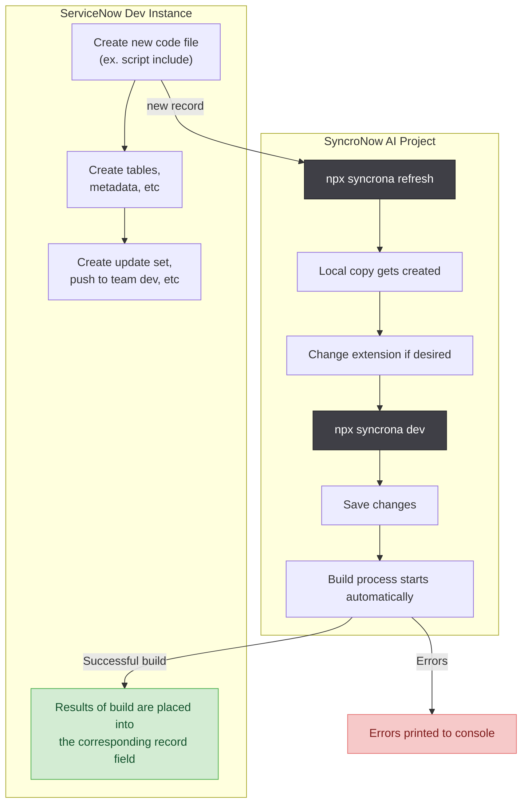
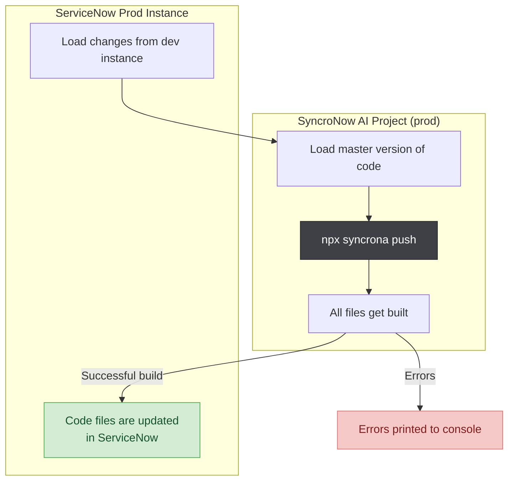

# SyncroNow AI

<!-- npm badges intentionally omitted: the @syncrona/* packages are not yet
     published to npm, so live npm version/downloads shields would render as
     "invalid". Restore them at first publish:
     [](https://www.npmjs.com/package/syncrona)
     [](https://www.npmjs.com/package/syncrona) -->

<!-- badges:start -->
|  |  | [](https://nodejs.org) | [](LICENSE) | [](https://www.typescriptlang.org/) |
|:--:|:--:|:--:|:--:|:--:|
| [](https://github.com/IvanBBaev/syncrona/actions/workflows/ci.yml) | [](https://github.com/IvanBBaev/syncrona/actions/workflows/codeql.yml) | [](https://codecov.io/gh/IvanBBaev/syncrona) | [](https://snyk.io/test/github/IvanBBaev/syncrona) | [](https://github.com/IvanBBaev/syncrona/commits/main) |
<!-- badges:end -->

_Built and maintained in my own time. If SyncroNow AI helps you or your team,
a sponsorship keeps it moving — it directly funds new features, fixes and
keeping pace with ServiceNow's REST surface._

[](https://github.com/sponsors/IvanBBaev)
[](https://ko-fi.com/ivanbbaev)
[](https://donatr.ee/ivanbbaev/)

## Overview

SyncroNow AI is a tool for managing ServiceNow code in a more modern way. It allows you to:

1. Store scoped app code in GitHub in an editable way.🐙 (Looking at you studio source control👀)
2. Run your code through build pipelines that enable you to write modern JavaScript and use modern development tools such as [TypeScript](https://www.typescriptlang.org/), [Babel](https://babeljs.io/), and [Webpack](https://webpack.js.org/). 🎉
3. Take control of your development process in ServiceNow! 💪

Because your scoped-app code is downloaded as plain, editable files in a project folder, SyncroNow AI is well suited for **tracking your ServiceNow source code in Git** — giving you real diffs, history, branches and pull requests over code that would otherwise live only inside the instance.

> **Heritage:** SyncroNow AI is a modern successor to
> [Sincronia](https://github.com/nuvolo/sincronia) (`sinc`). If you know that
> tool, the mental model carries over — but the CLI, package scope and build
> pipeline here are different (see [Installation](#installation)).

**Project documentation**

- [docs/ARCHITECTURE.md](docs/ARCHITECTURE.md) — package graph, the two
  ServiceNow clients and their shared transport policy, push/manifest flows,
  MCP request pipeline, and the **module contract** for adding/removing CLI
  commands and MCP tool families (mermaid diagrams).
- [docs/PRODUCT_STATE.md](docs/PRODUCT_STATE.md) — what works today, phase
  history, known gaps and operating constraints.
- [docs/MULTI_INSTANCE.md](docs/MULTI_INSTANCE.md) — credential precedence,
  instance profiles, the dev→prod workflow, and CI.
- [docs/MONOREPO_GUIDE.md](docs/MONOREPO_GUIDE.md) — multi-scope layout,
  per-scope vs shared config, and CI matrices.
- [docs/PLUGIN_DEVELOPMENT.md](docs/PLUGIN_DEVELOPMENT.md) — the plugin
  contract and how to write and wire your own build plugin.
- [docs/BUSINESS_ANALYSIS.md](docs/BUSINESS_ANALYSIS.md) — product vision,
  personas, value proposition, competitive positioning, KPIs, prioritized
  roadmap and risk register.
- [docs/COMPARISON.md](docs/COMPARISON.md) — SyncroNow AI vs ServiceNow native Git,
  Sincronia, and update sets (one-page comparison).
- [docs/MIGRATING_FROM_SINCRONIA.md](docs/MIGRATING_FROM_SINCRONIA.md) — moving
  an existing Sincronia (`sinc`) project over: command mapping, config
  conversion, and the first-day path.
- [docs/ENTERPRISE_READINESS.md](docs/ENTERPRISE_READINESS.md) — what remains
  for a public 1.0 / enterprise release (done / scheduled / owner-gated).
- [ROADMAP.md](ROADMAP.md) — shipped capabilities and the path to v0.5 beta and
  v1.0 (with owner-gated items called out).
- [SECURITY.md](SECURITY.md) — vulnerability reporting and data-handling.
- [SUPPORT.md](SUPPORT.md) — getting help, diagnostics, support scope.
- [docs/TROUBLESHOOTING.md](docs/TROUBLESHOOTING.md) — symptom → cause → fix
  index for auth, connectivity, proxy/TLS, manifest, watch-mode and MCP issues.
- [CONTRIBUTING.md](CONTRIBUTING.md) — dev setup, quality gates, conventions.
- [CODE_OF_CONDUCT.md](CODE_OF_CONDUCT.md) — community standards.
- [packages/mcp-server/README.md](packages/mcp-server/README.md) — MCP server
  setup, tools, guardrails, and safety notes.
- [docs/MCP_TOOLS.md](docs/MCP_TOOLS.md) — autogenerated API reference for all
  61 MCP tools (parameters, safety flags; regenerated via
  `generate-tool-reference.js`, drift-gated by its `--check` mode).
- [packages/credential-store/README.md](packages/credential-store/README.md) —
  the global encrypted credential store (AES-256-GCM at rest, key derivation)
  shared by the CLI and MCP server.
- [docs/VERSIONING.md](docs/VERSIONING.md) — semver policy, lockstep releases,
  the MCP tool-contract stability promise, and the Node.js support window.
- [CHANGELOG.md](CHANGELOG.md) — notable changes per release.

**Table of Contents**

- [SyncroNow AI](#syncronow-ai)
  - [Overview](#overview)
  - [Installation](#installation)
    - [Requirements](#requirements)
    - [Instructions](#instructions)
  - [How does it work?](#how-does-it-work)
    - [Commands](#commands)
      - [Using the diff option](#using-the-diff-option)
    - [Workflow](#workflow)
    - [File Structure](#file-structure)
      - [sync.config.js](#syncconfigjs)
      - [sync.manifest.json](#syncmanifestjson)
      - [sync.diff.manifest.json](#syncdiffmanifestjson)
      - [.env](#env)
    - [Asymmetric Source Code](#asymmetric-source-code)
    - [Power of Extensions](#power-of-extensions)
  - [Configuration](#configuration)
    - [There are WAY too many files in here!](#there-are-way-too-many-files-in-here)
    - [I'm not seeing all my code files!](#im-not-seeing-all-my-code-files)
    - [Plugin Configuration](#plugin-configuration)
    - [Table Options](#table-options)
  - [FAQ](#faq)
    - [How do I Delete Something?](#how-do-i-delete-something)
    - [How do I Add New Scripts?](#how-do-i-add-new-scripts)
    - [How do I work with multiple instances?](#how-do-i-work-with-multiple-instances)
    - [How do I work with several scoped apps in one repo?](#how-do-i-work-with-several-scoped-apps-in-one-repo)
    - [Getting unstuck](#getting-unstuck)
  - [Examples](#examples)
  - [Plugin List](#plugin-list)

## Installation

> ⚠️ **Not yet published to npm.** The `@syncrona/*` packages are
> pre-release and are **not on the npm registry yet**, so `npm i -g` /
> `npx syncrona` will not resolve. Until the first publish, install
> **from source** (below). The published-install snippet is shown for when the
> packages go live.

### Install from source (works today)

```bash
git clone https://github.com/IvanBBaev/syncrona
cd syncrona
npm ci
npm run build
# expose the CLI as `syncrona` on your PATH:
npm link --workspace syncrona
syncrona login
syncrona init
```

Prefer not to link globally? Run the built CLI directly from the repo with
`node packages/core/dist/index.js <command>`.

### Global CLI quick start (once published to npm)

```bash
npm i -g syncrona
syncrona login
syncrona init
```

### Requirements

In order to use SyncroNow AI, you will need:

- [Node.js](https://nodejs.org/en/) version 22.0 or later

> ⚠️ **Windows users:** WSL (Windows Subsystem for Linux) is currently
> **required** — native Windows is not yet supported.
>
> - Install WSL with an Ubuntu distribution (Windows version 1903+; earlier
>   versions are untested/not working)
> - Run all `syncrona` commands from inside the WSL shell
> - (Optional) Windows Terminal is recommended for proper text rendering
>
> Native Windows support (PowerShell install, Windows Credential Manager) is
> on the roadmap.

**ServiceNow compatibility:** SyncroNow AI talks to standard ServiceNow REST/Table
APIs and works with or without the companion scoped app, so it is broadly
release-agnostic. It is actively used against recent ServiceNow releases; a
formal supported-version matrix is being established — if you hit a
release-specific issue, please open an issue with your instance version.

**Authentication:** SyncroNow AI supports every inbound REST authentication method
ServiceNow offers, in **both** clients (CLI axios and the MCP server's native
fetch). Select the method explicitly with `SN_AUTH_METHOD`, or let it be inferred
for backward compatibility. Every auth variable also accepts a per-profile
`_<PROFILE>` suffix.

| Method (`SN_AUTH_METHOD`) | Required vars | Notes |
| --- | --- | --- |
| Basic — `basic` (default) | `SN_USER`, `SN_PASSWORD` | HTTP Basic over HTTPS. |
| OAuth password — `oauth-password` | `SN_OAUTH_CLIENT_ID`, `SN_OAUTH_CLIENT_SECRET`, `SN_USER`, `SN_PASSWORD` | OAuth 2.0 Resource Owner Password grant; Bearer token from `oauth_token.do`, refreshed on expiry/401. |
| OAuth client credentials — `oauth-client-credentials` | `SN_OAUTH_CLIENT_ID`, `SN_OAUTH_CLIENT_SECRET` | OAuth 2.0 Client Credentials grant — service-to-service, no user password (Tokyo+). |
| OAuth JWT bearer — `oauth-jwt-bearer` | `SN_OAUTH_CLIENT_ID`, `SN_OAUTH_CLIENT_SECRET`, `SN_JWT_KEY` | OAuth 2.0 JWT Bearer grant. `SN_JWT_KEY` is a path to (or inline) RS256 private-key PEM; a fresh signed assertion is minted per token. Optional `SN_JWT_KID` / `SN_JWT_ISS` / `SN_JWT_SUB` / `SN_JWT_AUD` override the JWT header/claims (defaults derived from client id + user + instance). |
| API key — `api-key` | `SN_API_KEY` | Inbound REST API Key sent as a header — default `x-sn-apikey`, override with `SN_API_KEY_HEADER` (Vancouver+). |

Without `SN_AUTH_METHOD` the method is inferred exactly as before — OAuth password
when a client id/secret pair **and** a password are present, otherwise Basic — so
existing setups keep working unchanged. Use a dedicated least-privilege
integration user.

**Mutual TLS (client certificate)** is orthogonal to the method above and combines
with any of them (or works alone): point `SN_CLIENT_CERT` and `SN_CLIENT_KEY` at
PEM files (plus `SN_CLIENT_KEY_PASSPHRASE` if the key is encrypted). It is applied
at the TLS layer in both the CLI and the MCP server.

`syncrona login` walks you through any of these interactively (method picker), or
runs non-interactively with flags — for example
`syncrona login --auth-method api-key --api-key XXXX` or
`syncrona login --auth-method oauth-client-credentials --client-id … --client-secret …`.
Secrets are kept in the encrypted global credential store; the JWT key and TLS
cert/key are referenced **by path**, never copied into it. See
[SECURITY.md](SECURITY.md) and [docs/MULTI_INSTANCE.md](docs/MULTI_INSTANCE.md).

**Corporate proxies & custom TLS (G9):** the CLI honors the standard
`HTTPS_PROXY` / `HTTP_PROXY` / `NO_PROXY` environment variables automatically, so
it works behind a corporate proxy with no extra configuration. For a corporate
or self-signed certificate authority, point `SYNCRONA_CA_BUNDLE` at a PEM CA
bundle (or set Node's built-in `NODE_EXTRA_CA_CERTS`, which also covers the MCP
server's native-fetch client). As a last resort for a throwaway test instance,
`SYNCRONA_TLS_REJECT_UNAUTHORIZED=0` disables certificate verification — insecure,
never use it against a real instance.

### Instructions

1. Create a folder to store the scoped app code.
2. In a terminal, run `npm init` inside the newly created folder and follow the instructions to set up your node module.
3. (Optional) Install the companion server scoped app on your instance — the CLI works against plain ServiceNow REST APIs **with or without** it; the scoped app only enables a few enhanced endpoints.
4. Install `syncrona`

```bash
npm i -D syncrona
```

4. Initialize your SyncroNow AI project

```bash
npx syncrona init
```

If your repository is a monorepo with many scoped apps under `packages/`, run SyncroNow AI from the specific scope directory, for example `packages/cs`. Each scope package should get its own `.env`, `sync.config.js`, and `sync.manifest.json`.

5. [Configure your project!](#configuration)
6. **OPTIONAL BUT HIGHLY RECOMMENDED** Once your project is configured the way you like, you can commit and push it to a git repository for superior tracking and version control! Make sure to create a `.gitignore` file and ignore `node_modules` and `.env` because you **really** don't want those files in your repository.
7. Start dev mode and start working! Every time you save a file that is tracked by SyncroNow AI, it will be built with your ruleset and the result will be placed in ServiceNow!

```bash
npx syncrona dev
```

## How does it work?

SyncroNow AI takes a two-pronged approach to managing your ServiceNow scoped app. Architecture, creation of records, deletion of records, metadata and other ServiceNow objects besides your actual source code will be managed normally. Your _source code itself_ will be managed inside of your SyncroNow AI project.

### Commands

SyncroNow AI has a few basic commands to help you get the job done

| Command            | Aliases  | Description                                                                                                                                                 | Usage                           |
| ------------------ | -------- | ----------------------------------------------------------------------------------------------------------------------------------------------------------- | ------------------------------- |
| `refresh`          | `r`      | Refreshes the `sync.manifest.json` file and downloads all new files created in ServiceNow since the last refresh. Does not override existing file contents. | `npx syncrona refresh`              |
| `dev`              | `d`      | Starts development mode. Watches files for changes, then builds and pushes them to the corresponding record. Only works on files in the manifest file.      | `npx syncrona dev`                  |
| `init`             | **none** | Walks you through creating a basic SyncroNow AI project. This is the recommended way to create a SyncroNow AI project from scratch.                               | `npx syncrona init`                 |
| `push`             | **none** | Builds and pushes all files in your local SyncroNow AI project to the ServiceNow instance in your `.env` file                                                  | `npx syncrona push`                 |
| `download <scope>` | **none** | Downloads the specified scoped app, overwriting all local files in the way. **Only use this if you know what you are doing!**                               | `npx syncrona download my_test_app` |
| `build`            | **none** | Builds the local SyncroNow AI project and stores the files locally                                                                                             | `npx syncrona build`                |
| `deploy`           | **none** | Deploys the files in the build folder to the ServiceNow instance.                                                                                           | `npx syncrona deploy`               |
| `docs`             | **none** | Generates or logically updates Markdown documentation and Mermaid diagrams describing the downloaded scope (overview, tables, per-record files).            | `npx syncrona docs`                 |
| `repair`           | **none** | Reconciles the manifest with local files: reports (default) or re-downloads files the manifest expects but are missing locally, and optionally prunes orphan files no record claims. Use `--apply` to re-download missing files, `--prune` (with `--apply`) to delete orphans, and `--ci` for non-interactive runs. | `npx syncrona repair`               |
| `status`           | **none** | Shows extended workspace status: instance/user/scope, config paths, env readiness, and connectivity diagnostics.                                           | `npx syncrona status`               |
| `check-env`        | **none** | Checks machine prerequisites (Node 22+, supported platform/WSL, Git) and prints actionable fixes.                                                          | `npx syncrona check-env`            |
| `doctor`           | **none** | Runs local configuration and ServiceNow connectivity diagnostics, and reports actionable failures.                                                         | `npx syncrona doctor`               |
| `plugins`          | **none** | Shows configured plugin rules and reports plugin package availability (installed or missing) from the current workspace.                                  | `npx syncrona plugins`              |
| `config <action>`  | **none** | Inspect or extend configuration. `config show-defaults` prints the built-in default includes/excludes; `config add-plugin [--plugin <name>]` lists the first-party build plugins (with install status) and prints a paste-ready `rules` snippet. | `npx syncrona config add-plugin --plugin typescript` |
| `completion [shell]` | **none** | Prints a shell tab-completion script covering every `syncrona` command. Pass `bash` or `zsh`, or omit the argument to auto-detect the shell from `$SHELL`; append the output to your shell rc file to install it. | `npx syncrona completion`           |
| `mcp`              | **none** | Starts standalone MCP server and can auto-configure local MCP client files (`.vscode/mcp.json`, `.syncrona-mcp/secrets.json`).                            | `npx syncrona mcp`                  |
| `login [instance]` | **none** | Saves ServiceNow credentials in the encrypted global CredentialStore and optionally sets active instance.                                                  | `npx syncrona login dev123.service-now.com` |
| `logout [instance]`| **none** | Removes stored credentials for one instance (or all with `--all`) from the global CredentialStore.                                                       | `npx syncrona logout dev123.service-now.com` |
| `instances`        | **none** | Lists instances saved in the global CredentialStore and marks the active one.                                                                              | `npx syncrona instances`            |
| `use <instance>`   | **none** | Sets active instance from the global CredentialStore for subsequent commands.                                                                              | `npx syncrona use dev123.service-now.com` |
| `jira [key]`       | `--profile`, `--comments`, `--json` | Fetches rich context for a Jira issue (summary, description, status, type, priority, assignee/reporter, labels, components, parent, subtasks, links, fix versions, recent comments). Resolves the key from the argument or the current git branch name. Supports Jira Cloud and Server/Data Center. | `npx syncrona jira SCRUM-123` |
| `jira-login`       | `--profile` | Saves Jira credentials in the encrypted global CredentialStore. Auto-detects Cloud vs Server/Data Center from the base URL and verifies the connection. | `npx syncrona jira-login` |
| `jira-logout`      | `--profile`, `--all` | Removes stored Jira credentials for one profile (or all with `--all`) from the global CredentialStore. | `npx syncrona jira-logout` |

`init` wizard behavior notes:

1. Prefers credentials from environment when available.
2. Falls back to the active CredentialStore instance before prompting.
3. Persists selected credentials to the global CredentialStore and writes `.env`.
4. Runs a lightweight initial doctor connection check at the end of setup.

#### Credential storage security

The global CredentialStore writes each instance's credentials to
`~/.syncrona/credentials/<instance>.enc`, encrypted with AES-256-GCM. The
encryption key is resolved with this precedence:

1. **`SYNCRONA_STORE_KEY`** — an explicit 32-byte key (64 hex characters or
   base64). Use this for CI/CD and shared environments, sourced from a secrets
   manager. This is the strongest option.
2. **OS keychain (default)** — used automatically when the optional
   `@napi-rs/keyring` dependency is installed; opt out with
   `SYNCRONA_USE_KEYCHAIN=0` (e.g. headless CI with no keychain). A random
   256-bit master key is generated once and stored in the OS keychain (macOS
   Keychain / Windows Credential Manager / libsecret). The on-disk files stay
   useless without keychain access.
3. **Machine-derived key (fallback)** — derived from your machine hostname and
   username, used automatically when the keychain / `@napi-rs/keyring` is
   unavailable. This is **obfuscation-grade, not strong cryptography**. Reads
   retry with this key so stores written before the keychain default keep
   decrypting.

> ⚠️ With the machine-derived fallback key, anyone who can read the `.enc` file
> **and** run code as your user on the same machine (or who knows your hostname +
> username) can decrypt the credentials. It guards against casual inspection and
> accidental file sharing — not a compromised account, stolen disk, or malware
> running as your user. Configure an explicit key or the keychain for real
> at-rest protection.

Reads fall back to the machine-derived key, so credential files written before
this change keep decrypting; the next `syncrona login` re-encrypts them with the
resolved key.

Recommendations:

- Treat the machine as a trust boundary. Rely on OS file permissions
  (`~/.syncrona` is created with user-only access) and full-disk encryption.
- For **CI/CD and shared environments**, set `SYNCRONA_STORE_KEY` from a secrets
  manager (or prefer plain environment variables over the on-disk store).
- On a workstation, the OS keychain is used automatically (as long as the
  optional `@napi-rs/keyring` dependency is installed) — no flag needed. Set
  `SYNCRONA_USE_KEYCHAIN=0` only to opt out (e.g. headless environments).
- Always use a dedicated integration user with least-privilege roles, and rotate
  its password if a credential file may have been exposed.

#### Using the diff option

`--diff <branch>` means **different things for `push` and `build`** — both use
`git diff <branch>...` against your source folder, but apply it differently:

- **`syncrona push --diff <branch>`** pushes **only the files that changed**
  versus that branch. This is the "changed-only" push — use it to push just your
  feature's edits instead of the whole scope.

  ```bash
  npx syncrona push --diff main
  ```

- **`syncrona build --diff <branch>`** builds **all** source files but also
  writes a `sync.diff.manifest.json` recording which files changed, so a later
  `syncrona deploy` can target just those (an audit/deploy-tracking trail).

  ```bash
  npx syncrona build --diff main
  ```

Without `--diff`, `push` and `build` act on the entire source folder.

#### Other push options

`push` accepts a few more flags for scope handling, change tracking and
automation:

- `--scope-swap` (`--ss`) — auto-swap to the correct application scope for the
  files being pushed instead of failing on a scope mismatch.
- `--update-set <name>` (`--us <name>`) — create a new update set with the given
  name and record all pushed changes into it.
- `--push-concurrency <n>` (`--concurrency <n>`) — max records pushed in parallel
  (1–50; overrides `pushConcurrency` in `sync.config.js`, default 10).
- `--ci` — skip all confirmation prompts (for CI/automation). `download` accepts
  `--ci` too, to skip its overwrite confirmation.

```bash
npx syncrona push --update-set "PRJ-123 changes" --scope-swap
npx syncrona push --ci --concurrency 5
```

#### Using dry-run mode

For commands that can change remote or local artifacts (`push`, `deploy`, `download`, and `build`), you can preview effects without applying writes by adding `--dry-run`.

```bash
npx syncrona push --dry-run
```

#### Using instance profiles

To work with multiple ServiceNow instances from one workspace, define profile-specific env vars and select them with `--instance-profile`.

```bash
SN_INSTANCE_DEV=dev123.service-now.com
SN_USER_DEV=dev.user
SN_PASSWORD_DEV=dev.password

npx syncrona status --instance-profile dev
```

Profile vars (`SN_INSTANCE_<PROFILE>`, `SN_USER_<PROFILE>`, `SN_PASSWORD_<PROFILE>`) fall back to base vars when a specific value is missing.

#### Manifest refresh in dev mode

In `dev` mode SyncroNow AI periodically re-reads the instance manifest to pick up
records created in ServiceNow since you started (it does **not** overwrite local
file contents). The interval defaults to **30 seconds** (`refreshInterval` in
`sync.config.js`). Overlapping refreshes are guarded — a slow refresh never
stacks. On a slow network, raise the interval or disable polling:

```bash
npx syncrona dev --refresh-interval 60   # poll every 60s
npx syncrona dev --refresh-interval 0    # disable polling; refresh manually with `syncrona refresh`
```

Run with `--log-level debug` to see `Manifest refresh took Xms` and per-file
rule matches.

#### Jira integration

`syncrona jira [key]` pulls read-only context for a Jira issue (summary,
description, status, type, priority, assignee/reporter, labels, components,
parent, subtasks, links, fix versions and recent comments) — handy for pairing
an issue with the ServiceNow change you are working on. If you omit the key, the
CLI parses it from the current git branch name (e.g. `feature/SCRUM-123-foo` →
`SCRUM-123`). It supports both **Jira Cloud** and **Jira Server / Data Center**.

Save credentials once with `syncrona jira-login`; they are stored in the
same encrypted global CredentialStore as ServiceNow credentials. Configuration
is resolved with this precedence (first match wins):

1. `--profile <name>` — a named profile in the CredentialStore.
2. Environment variables (below).
3. The default stored Jira profile.

| Variable           | Purpose                                                                                     |
| ------------------ | ------------------------------------------------------------------------------------------- |
| `JIRA_BASE_URL`    | Jira base URL, e.g. `https://acme.atlassian.net` (Cloud) or `https://jira.acme.com` (Server / DC). |
| `JIRA_TOKEN`       | Cloud API token, or a Server / Data Center Personal Access Token (PAT).                      |
| `JIRA_EMAIL`       | Account email — **required for Cloud** (paired with the API token as Basic auth). Omit for Server / DC PAT (Bearer) auth. |
| `JIRA_DEPLOYMENT`  | Force the deployment type: `cloud` or `server`. Auto-detected from the base URL when unset.  |

See [packages/jira/README.md](packages/jira/README.md) for the full
configuration reference (Cloud vs Server/DC auth semantics, profiles and
precedence).

### Workflow

**Development workflow** — you author code on your ServiceNow dev instance,
SyncroNow AI pulls a local copy, and every save is built and pushed back to the
matching record automatically.



**Deployment** — point the same project at a higher instance (e.g. prod) and
`push` the master version of the code up.



### File Structure

When you download your source code using SyncroNow AI, it creates a folder structure that goes as follows:

```text
project_folder/
  src/
    table_name/
      record_name/
        field_name.extension
```

Records are shown as folders because there are times where there are multiple code files per record. This makes it very important that you **never have records with the exact same display value in the same table!** If you do, then you will notice issues building your files to the right record in ServiceNow.

#### sync.config.js

This is the configuration file for SyncroNow AI. [Learn More](#configuration)

#### sync.manifest.json

Keeps track of all ServiceNow files that are watched by SyncroNow AI. **Do not manually modify it**

#### sync.diff.manifest.json

Tracks changed files for build and deploy commands when using diff option.

#### .env

Stores login credentials and and the instance URL. **Do not commit this to git**

### Asymmetric Source Code

When you download your source code using SyncroNow AI, you are effectively 'taking control' of that code. **Once the code is in your project, you no longer want to edit it directly in ServiceNow!** This is why putting your code into source control is highly recommended. **Anything else besides code, such as tables, configuration of script records, metadata, etc. must still be tracked in ServiceNow and passed along with your preferred method of moving ServiceNow architecture**

Modern javascript development workflows are **asymmetric**, meaning that the source code you write is usually not the code that gets executed. It is built using various tools and compiled/transpiled into some more compatible or smaller javascript code that is run by browsers or node environments.

SyncroNow AI takes advantage of this same principle by allowing you to leverage some of those same tools. This means that you will no longer be able to store your source code directly in ServiceNow, instead you will have a local version of your source code that gets built and the result of that build will be put into ServiceNow.

**EXAMPLE**

Let's say I want to develop using TypeScript. Once I have the right plugin configuration for my needs, this Typescript file:

```typescript
// Example/script.ts
class Example {
  constructor(message: string) {
    gs.info(message);
  }
  sayHello() {
    gs.info("Hello, SyncroNow AI!");
  }
}
```

becomes

```javascript
// ServiceNow `Example` script include.
"use strict";

function _classCallCheck(instance, Constructor) {
  if (!(instance instanceof Constructor)) {
    throw new TypeError("Cannot call a class as a function");
  }
}

function _defineProperties(target, props) {
  for (var i = 0; i < props.length; i++) {
    var descriptor = props[i];
    descriptor.enumerable = descriptor.enumerable || false;
    descriptor.configurable = true;
    if ("value" in descriptor) descriptor.writable = true;
    Object.defineProperty(target, descriptor.key, descriptor);
  }
}

function _createClass(Constructor, protoProps, staticProps) {
  if (protoProps) _defineProperties(Constructor.prototype, protoProps);
  if (staticProps) _defineProperties(Constructor, staticProps);
  return Constructor;
}

var Example =
  /*#__PURE__*/
  (function () {
    function Example(message) {
      _classCallCheck(this, Example);

      gs.info(message);
    }

    _createClass(Example, [
      {
        key: "sayHello",
        value: function sayHello() {
          gs.info("Hello, SyncroNow AI!");
        },
      },
    ]);

    return Example;
  })();
```

### Power of Extensions

File extensions are typically only one short blurb (e.g. `.js`, `.css`, etc.). When you use SyncroNow AI, you may find that you want to treat one `.js` file differently than another. That's where extensions can become more powerful! You could create an extension in your project such as `.server.js` and `.client.js` which you could combine with the [rules](#plugin-configuration) configuration of SyncroNow AI to have _two different build pipelines_. You could use Webpack for client scripts and Babel for server scripts! Pretty cool huh?

As long as the main filename stays the same, you can add as many extensions as you want.

**EXAMPLE**

`script.js` becomes `script.servicenow.js` or `script.ts` or `script.what.ever.you.want.js`

## Configuration

SyncroNow AI aims to be as configurable as possible. To do that, it creates a special javascript file in your project directory called `sync.config.js`. It's contents will look something like this:

```javascript
module.exports = {
  // Directory where your source files will be kept and will be watched by SyncroNow AI
  // during development.
  sourceDirectory: "src",
  //Directory where local builds will be stored
  buildDirectory: "build",
  // This is where you will configure your plugins. You match based on plugins.
  // Order your rules by MOST SPECIFIC extension first! The first match is the
  // only one that gets executed.
  rules: [],
  // === INCLUDES/EXCLUDES apply on top of the default config! See more below ===
  // Tables/fields to exclude (AKA not download or track) from SyncroNow AI
  excludes: {},
  // Tables/fields to explicitly include in your SyncroNow AI project.
  // Can override excludes if necessary.
  includes: {},
  //How often syncrona will refresh the manifest in development mode
  refreshInterval: 30,
  // (Experimental, opt-in) Use a flat local layout
  // <table>/<record>~<field>.<ext> instead of per-record folders. The mapping
  // is lossless and reversible (see "Flat layout" below).
  flat: false,
};
```

If you find that your config is getting too large, you can use typical nodejs techniques for splitting it into smaller modules and loading them into the `sync.config.js`.

#### Flat layout (experimental)

By default each record is stored as a folder of field files
(`<table>/<record>/<field>.<ext>`). Setting `flat: true` selects a flatter
layout that collapses the per-record folder into one file per field, keeping
table, record and field so the mapping stays **lossless and reversible**:

```
sys_script_include/MyUtil/script.js      ->  sys_script_include/MyUtil~script.js
```

The `~` separator never appears in a ServiceNow dictionary field name, so the
record is everything before the last `~` and the field everything after it. The
conversion is implemented as pure, fully-tested helpers
(`folderRelToFlat` / `flatRelToFolder` in `packages/core/src/flatLayout.ts`).
`pull`/`push`/`build` honour `flat: true` automatically — files are written and
read back in the flat shape, and the build tree mirrors it so `deploy` works
unchanged. It remains opt-in and labelled experimental pending broad validation
against a live instance; switching `flat` on an existing workspace re-lays files
on the next `refresh`.

### There are WAY too many files in here!

**OR**

### I'm not seeing all my code files!

When you first set up your project, you may notice you may have more files than you want to manage or some files are missing. This can be easily resolved by tweaking your `includes` and `excludes` section of your `sync.config.js`. SyncroNow AI attempts to establish sane defaults for these values [here](packages/core/src/defaultOptions.ts) (and you can list them with `syncrona config show-defaults`).

If you think there is something wrong with the default setup, feel free to submit a pull request! 🐙👍

The `excludes` and `includes` sections in your `sync.config.js` act as additions to that default setting. You can override parts of it or turn parts of it off.

Once you have updated your includes and excludes, run `npx syncrona refresh` to load the new files and update the manifest. You will have to manually delete any newly excluded tables/fields.

```javascript
// sync.config.js
module.exports = {
  excludes: {
    // Turns off the default exclusion of the `sys_scope_privilege` table
    sys_scope_privilege: false,
    // Excludes everything from the `my_cool_table` table
    my_cool_table: true,
    // Excludes the `cool_script` field specifically from the `new_cool_table` table.
    // Other valid fields will be included.
    new_cool_table: {
      cool_script: true,
    },
  },
  includes: {
    // Turns off the default inclusion of the `content_css` table
    content_css: false,
    // Explicitly includes the `sys_report` table. Overrides any excludes on the
    // same table.
    sys_report: true,
    // Explicitly pulls in the `neat_script_field` as a `js` file in spite of whatever
    // type of field it might be in ServiceNow. Useful for text fields that
    // represent code.
    special_code_table: {
      neat_script_field: {
        type: "js",
      },
    },
  },
};
```

### Plugin Configuration

Plugins are where the true 💪 **POWER** 💪 of SyncroNow AI comes from! The `rules` section is used to configure plugins. When configuring plugins, **Make sure to always put your rules in the order you want them matched! The first rule that gets matched will be the only one that runs!**

```javascript
// sync.config.js
module.exports = {
  rules: [
    {
      // The match argument is a regular expression that will match on your desired files
      // The order matters, so put your most specific rules first!
      // If there is a file that ends in `.secret.ts` it will match here and
      // NO PLUGINS WILL BE RUN
      match: /\.secret\.ts$/,
      plugins: [],
    },
    {
      // If there are just generic TypeScript files that have no other extension, they will
      // match on this rule instead.
      match: /\.ts$/,
      // List of plugins to run on the matched files. Each plugin will run in order.
      // THE RESULT OF THE PREVIOUS PLUGIN WILL BE PASSED TO THE NEXT PLUGIN so make
      // sure they are in the right order!
      plugins: [
        {
          // The name of the plugin, it is the same as the name of the NPM package of
          // the plugin.
          name: "@syncrona/typescript-plugin",
          // Options to pass to the plugin. This will be defined by the plugin itself.
          // In this case, we are telling the typescript plugin to only type check and
          // not transpile.
          options: {
            transpile: false,
          },
        },
      ],
    },
  ],
};
```

### Table Options

**This is a relatively new feature and potentially subject to change**

The `tableOptions` section allows for special setups on any table. Example:

```javascript
// sync.config.js
module.exports = {
  // ...
  tableOptions: {
    some_table: {
      // sets the field used for the record folder name
      displayField: "some_field",
      // Allows to de-duplicate records based on certain fields
      differentiatorField: "sys_id",
      // can be an array, if there isn't a value in a field, it moves to the next one
      differentiatorField: ["some_field", "sys_id"],
      // an encoded query to filter records by
      query: "some_field=test",
    },
  },
};
```

**When to use each option**

- **`displayField`** — the field whose value names each record's folder. Use it
  when a table's default display value is empty, non-unique, or not filesystem-
  friendly (e.g. records keyed by a code field rather than `name`). Picking a
  field with a clear, unique value per record keeps the folder tree readable.
- **`differentiatorField`** — appended in parentheses to disambiguate records
  that share the same `displayField` value (otherwise they would collide on the
  same folder and one would overwrite the other — see the "never have records
  with the same display value" warning under [File Structure](#file-structure)).
  Use it when a table legitimately has duplicate display values; point it at a
  field that differs between them (e.g. `version`, or `sys_id` as a last resort).
  An array tries each field in order until one has a value.
- **`query`** — an encoded query that limits which records are tracked for the
  table. Use it to scope large tables down to the records you actually edit.

**Note on differentiatorField**

This feature will currently put a colon in the filename, which breaks the
Windows filesystem (and WSL paths under `/mnt`). Prefer a non-`sys_id`
differentiator where possible, and avoid it entirely if your team works on
native Windows.

## FAQ

### How do I Delete Something?

Deleting something in SyncroNow AI is relatively simple. Just follow these steps:

1. Turn off dev mode if you are currently running SyncroNow AI
2. Delete the record in ServiceNow
3. Run `npx syncrona refresh`
4. Remove the files from your project

Why is this not automatic? Deleting files can be a dangerous game and it should be a deliberate action!

### How do I Add New Scripts?

1. Turn off dev mode if you are currently running SyncroNow AI
2. Create the record in ServiceNow
3. Run `npx syncrona refresh` and the files will get created automatically 👍

### How do I work with multiple instances?

Use the global credential store (`syncrona login` / `syncrona use`) or
instance-profile env vars and `--instance-profile`. `syncrona status` shows
which instance and credential source are active. Full guide:
[docs/MULTI_INSTANCE.md](docs/MULTI_INSTANCE.md).

### How do I work with several scoped apps in one repo?

Treat each scope as its own project under `packages/`, run commands from the
scope directory, and share `node_modules`/plugins at the root. Full guide:
[docs/MONOREPO_GUIDE.md](docs/MONOREPO_GUIDE.md).

### Getting unstuck

- **"credentials missing" after logging in** — the stored credential file may
  not decrypt on this machine. Run `syncrona status --debug-credentials`; if it
  reports a decrypt failure, re-run `syncrona login`.
- **Connecting to the wrong instance** — run `syncrona status` and check
  `Credentials from:`. A stale project `.env` wins over the store; fix or remove
  it, or pass `--instance-profile`.
- **`syncrona download` overwrote my edits** — `download` is destructive by
  design (it confirms first; `--ci` skips the prompt). Keep your source in git
  so a bad download is a `git checkout` away.
- **A push failed partway** — fix the cause and run `syncrona push` again; it
  offers to resume only the records that failed last time.
- **A download failed partway** — just run `syncrona download <scope>` again;
  it records completed tables in `sync.download.checkpoint.json` and resumes with
  the tables it has not fetched yet instead of starting over.
- **Slow network** — `syncrona dev --refresh-interval 60` polls less often, and
  `syncrona push --concurrency 5` throttles parallel pushes.
- **Environment problems** — `syncrona check-env` verifies Node, platform/WSL,
  and Git, and prints actionable fixes.

## Examples

After downloading a scope, run `npx syncrona docs` to generate Markdown
documentation and Mermaid diagrams for it (overview, tables, per-record files) —
a quick way to explore what a real SyncroNow AI project looks like.

## Plugin List

| Name                                                                       | Description                                 |
| -------------------------------------------------------------------------- | ------------------------------------------- |
| [@syncrona/babel-plugin](packages/babel-plugin/README.md)                 | Runs Babel on .js/.ts files                 |
| [@syncrona/prettier-plugin](packages/prettier-plugin/README.md)           | Prettifies your output files using Prettier |
| [@syncrona/sass-plugin](packages/sass-plugin/README.md)                   | Runs the Sass compiler on your files        |
| [@syncrona/typescript-plugin](packages/typescript-plugin/README.md)       | Type checks and compiles TypeScript files   |
| [@syncrona/webpack-plugin](packages/webpack-plugin/README.md)             | Creates Webpack bundles with your files     |
| [@syncrona/eslint-plugin](packages/eslint-plugin/README.md)               | Runs ESLint on your files on build          |

## Support

This project is built and maintained in my own time. If it saves you or your team
time, please consider supporting its continued development — sponsorship directly
funds new features, fixes and maintenance.

- **[GitHub Sponsors](https://github.com/sponsors/IvanBBaev)** — one-off or
  recurring, with no platform fee taken out (the preferred option).
- **[Ko-fi](https://ko-fi.com/ivanbbaev)** — quick one-off support; it also
  accepts **PayPal**, so it's the fallback for anyone without a GitHub account.
- **[Donate (Donatree)](https://donatr.ee/ivanbbaev/)** — a no-account donation
  page (card, PayPal and more) for a one-off tip.

[](https://github.com/sponsors/IvanBBaev)
[](https://ko-fi.com/ivanbbaev)
[](https://donatr.ee/ivanbbaev/)

## Trademarks & license

ServiceNow is a registered trademark of ServiceNow, Inc. This project is an
independent, third-party tool and is not affiliated with, endorsed by, or
sponsored by ServiceNow, Inc. All other trademarks are the property of their
respective owners.

SyncroNow AI is licensed under the **[GNU General Public License v3.0](LICENSE)**
(GPL-3.0-or-later). It is a derivative work of
[Sincronia ("sinc")](https://github.com/nuvolo/sincronia) by Nuvolo, which is
licensed under GPL-3.0; substantial portions of the build/plugin packages, CLI
core, and shared types originate from that project and remain under GPL-3.0. See
[NOTICE](NOTICE) for full attribution and [docs/PROVENANCE.md](docs/PROVENANCE.md)
for the complete provenance/IP analysis. As required by the GPL, redistributions
must preserve these notices and make the corresponding source available.
