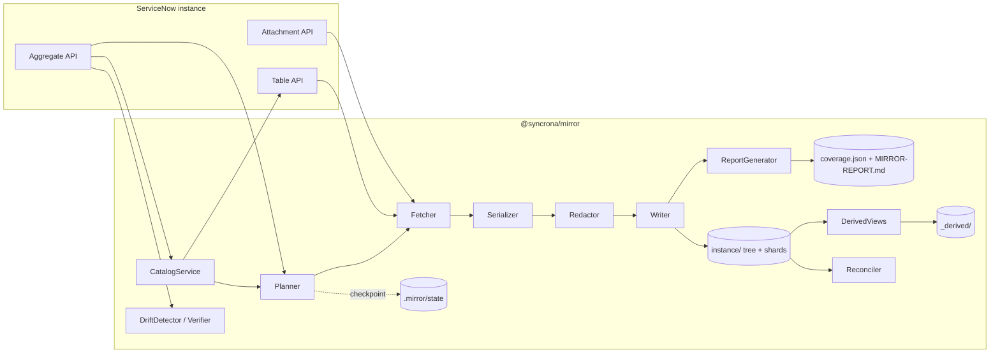
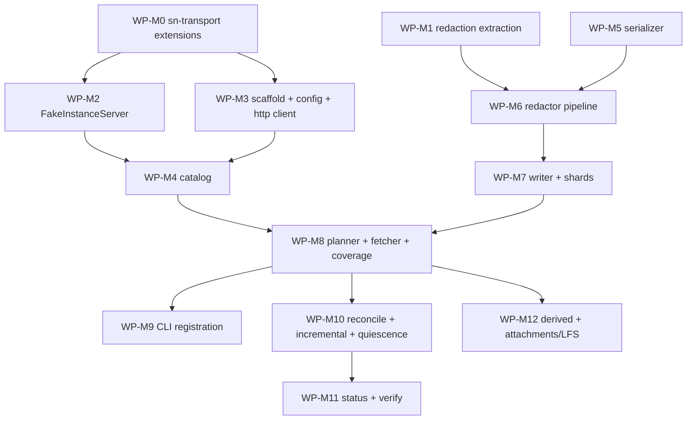

# Full-Instance Git Mirror — Architecture

Implementation-ready architecture for the mirror described in
[full-instance-git-mirror.md](full-instance-git-mirror.md) (the *design document*,
cited as "design §N") and analyzed in [mirror-analyses.md](mirror-analyses.md)
(cited as "analyses §N"). The design document explains *why*; this document is the
*build spec*: contracts, component specifications, invariants, and work packages
sized for independent implementation agents.

Precedence: where this document refines the design document, this document wins;
every such refinement is listed in [§14 Deltas](#14-deltas-vs-the-design-document).
The design deltas **D1–D21** from analyses §10 are binding here and are referenced
inline. D1–D14 came out of the analyses themselves; D15–D21 came out of the live
probe against a 1M-row vendor instance (analyses §7) and therefore overrule any
sizing or API assumption this document inherited from the design document.

---

## 1. How implementing agents use this document

1. Read §2 (overview), §4 (contracts), and the spec of the component(s) your work
   package touches (§5). Skim design §7–§9 for rationale when a rule seems
   arbitrary — it never is.
2. Your work package (§12) lists: goal, files, contracts to implement, upstream
   dependencies, acceptance criteria, and required tests. **Acceptance criteria are
   the definition of done** — not "code compiles".
3. The invariants ledger (§13) is law. If your change would violate an invariant,
   stop and flag it — do not "temporarily" break one.
4. Everything in `packages/mirror` must be testable offline against the
   FakeInstanceServer (WP-M2). If you need a network to test your code, the design
   of your code is wrong.
5. Monorepo conventions apply: Node 22, `npm run check` at the root before calling
   a package done; new CLI commands update README **and** CLAUDE.md command tables
   in the same change (docs-drift gate).
6. Normative keywords: MUST / MUST NOT / SHOULD are used in the RFC-2119 sense.

## 2. System overview

The mirror is a new, additive project type: a git repository whose working tree is
a canonical, byte-stable, redacted projection of an entire ServiceNow instance,
plus a regenerable human-oriented derived layer and an honest coverage report.
v1's per-scope workflow is untouched (design §13.4).



Data flows in exactly one direction: instance → tree. Every byte that reaches the
tree has passed the Serializer and then the Redactor (INV-3); the Writer cannot
type-check against unredacted input (§9).

## 3. Package layout and dependency rules

| Package | Status | Role |
|---|---|---|
| `packages/sn-transport` (`@syncrona/sn-transport`) | extended | Shared instance-communication policy: existing auth/OAuth/JWT/TLS/retry-status helpers, **plus** (WP-M0) keyset query builder, Retry-After-aware retry delay, error-envelope classifier, tri-state reachability diagnosis, and the path-safety lift. |
| `packages/redaction` (`@syncrona/redaction`) | new | Secret detection/redaction extracted from `packages/mcp-server/src/audit.ts`; consumed by mcp-server and mirror. Independently versioned scanner corpus (analyses §3 T1). |
| `packages/mirror` (`@syncrona/mirror`) | new | Everything mirror-specific: config, catalog, planner, fetcher, serializer, redactor pipeline, writer, shards, reconciler, drift/verify, derived views, report generator, FakeInstanceServer test asset. |
| `packages/core` (`syncrona`) | touched once | Registers the `mirror` command in `CLI_COMMANDS` (`packages/core/src/cliCommands.ts:95`) and delegates in-process to `@syncrona/mirror` (WP-M9). Nothing else in core changes. |

Dependency rules (enforced by review; a `package.json` cycle is a build failure):

- `@syncrona/mirror` depends on `@syncrona/sn-transport`,
  `@syncrona/credential-store` and `@syncrona/redaction` — and, as built, on
  nothing else. `axios` and `axios-rate-limit` were planned here and are NOT
  used: the client runs on Node 22's global `fetch` behind an injected
  `MirrorFetch` seam, and the rate limiter is a promise chain with injected
  `sleep`/`now`. That is not merely a smaller dependency tree — it is why the
  limiter is asserted against exact spacing values rather than elapsed wall
  time, which is the difference between a deterministic test and a flaky one.
  It MUST NOT depend on `syncrona` (core) — core depends on mirror, and the
  mirror deliberately shares no code with the v1 manifest pipeline (design §3.2
  constraint #1).
- `@syncrona/redaction` depends on nothing internal (leaf package).
- The mirror builds its own thin HTTP client (§5.2) on sn-transport policies +
  credential-store auth. Core's `snClient.ts` is not reused and not modified —
  binary GET (Attachment API) lives in the mirror's client. *(Delta Δ1 vs design
  §13.3, see §14.)*

Mirror-repo layout produced at runtime (design §8.1–§8.2, unchanged):

```
<mirror-repo>/
  mirror.config.js
  .gitattributes                 # LFS patterns (WP-M12)
  MIRROR-REPORT.md               # committed, human coverage report
  coverage.json                  # committed, machine coverage report
  instance/<scope>/<table>/<record-name>/record.json [+ extracted files]
  instance/<scope>/<table>/.shards/<prefix>.json     # sharded manifests
  _derived/...                   # regenerable projections (INV-9)
  .mirror/.gitignore                 # bare `*` — nothing under .mirror/ is committed
  .mirror/state/checkpoint.json      # observed-progress state
  .mirror/state/sync-counter.json    # completed syncs; drives the reconcile cadence (§5.4)
```

## 4. Contracts (TypeScript, normative)

These interfaces live in `packages/mirror/src/contracts.ts` (single module, no
implementation code) except where noted. Implementation agents MUST NOT widen a
type or add optional fields without updating this document.

### 4.1 Configuration

```ts
/** Resolved shape of mirror.config.js after loader validation + defaults. */
export interface MirrorConfig {
  formatVersion: 1;
  /** credential-store instance alias; default = active instance. */
  instance?: string;
  scopes: "all" | string[];
  tiers: { referenceData: boolean };            // T3 opt-in; T1/T2 always, T4 never
  tables: {
    include: string[];                          // force-include beyond tier rules
    exclude: string[];                          // never fetched; reported in coverage
    perTable: Record<string, PerTableConfig>;
  };
  attachments: { enabled: boolean; lfsThresholdBytes: number }; // default 262144, binaries only (confirmed, analyses §9)
  redaction: { propertyAllowlist: string[] };   // sys_properties keys allowed verbatim
  derived: { forms: boolean; workflows: boolean; refs: boolean; aclMatrix: boolean }; // D9
  sync: {
    reconcileEveryNSyncs: number;               // default 10
    requestsPerSecond: number;                  // default 4, hard max 20 (sn-transport cap)
    pageSize: number;                           // default 1000
  };
  /** Expected-drift rules for the cross-instance diff REPORT only (D13). */
  diffIgnore: Array<{ table: string; field?: string; sysId?: string }>;
}

export interface PerTableConfig {
  /** User-declared churn fields excluded from record.json (D7). */
  ignoreFields?: string[];
  redact?: "sensitive-keys" | "all" | "none";   // "none" requires propertyAllowlist-style explicitness
}
```

### 4.2 Catalog

```ts
export interface TableCatalogEntry {
  name: string;
  sysId: string;                       // sys_db_object row sys_id
  superClass: string | null;
  isMetadata: boolean;                 // in the sys_metadata super_class closure (design §4.2)
  tier: 1 | 2 | 3;
  rowCount: number | null;             // Aggregate COUNT; null = Aggregate unavailable
  maxUpdatedOn: string | null;         // Aggregate MAX(sys_updated_on), ISO-8601
  fields: FieldDescriptor[];
  status: "included" | "excluded-config" | "excluded-tier" | "skipped-empty" | "acl-denied";
}

export interface FieldDescriptor {
  element: string;
  internalType: string;                // sys_dictionary internal_type
  extractAs: string | null;            // file extension via SN_TYPE_MAP, else null
  isJsonBlob: boolean;
  isNoise: boolean;                    // sys_updated_on/by, sys_mod_count → manifest, not record.json
  isDenied: boolean;                   // field-type redaction deny (password, password2, …)
  reference: string | null;            // referenced table for reference fields
  maxLength: number | null;
}
```

### 4.3 Shard manifests

```ts
export interface ShardManifest {
  formatVersion: 1;
  table: string;
  /** sys_id hex prefix ("" when fanout 0); length === fanout. */
  shard: string;
  /** Hex-prefix fan-out depth for this table: 0 = single file, 1 = 16 shards,
   *  2 = 256. Chosen at the table's first complete sweep per SHARD_FANOUT (§11)
   *  and STICKY thereafter — changed only via `mirror migrate` (D16). */
  fanout: 0 | 1 | 2;
  complete: boolean;                   // INV-4: true only after a finished table sweep
  /** The sweep that last CHANGED this shard — not the last sweep that ran. A flush
   *  whose only difference from the file on disk is this field does not write, or an
   *  unchanged instance would rewrite every shard in the repo and INV-1 would fail on
   *  provenance rather than on data. Corollary: a `.shards/` directory whose files
   *  carry different sweep ids is the normal steady state, not evidence of a torn
   *  flush — `mirror verify` must read INV-4 off `complete`, never off this field. */
  sweepId: string;
  records: Record<string, RecordEntry>; // key = sys_id, validated INV-6
}

export interface RecordEntry {
  path: string;                        // repo-relative record directory
  name: string;                        // folded record name (design §7.4)
  sysUpdatedOn: string;
  sysUpdatedBy: string;
  sysModCount: number;
  contentHash: string;                 // sha256 hex of canonical record.json bytes
  files: string[];                     // extracted field files, sorted
  attachments?: Array<{ sysId: string; fileName: string; sizeBytes: number; sha256: string; lfs: boolean }>;
}
```

### 4.4 Coverage

```ts
export type CoverageReason =
  | "transient-exhausted" | "acl-403" | "not-visible" | "instance-unreachable"
  | "column-missing" | "parse-failure" | "redacted-overflow"
  | "excluded-config" | "excluded-tier" | "not-exportable";

export interface CoverageReport {
  formatVersion: 1;
  sweepId: string;
  mode: "full" | "incremental" | "reconcile";
  startedAt: string;
  finishedAt: string;
  quiescent: boolean | null;           // D1; null = --verify-quiescent not requested
  exitCode: 0 | 1 | 2;                 // analyses §2 R1
  totals: {
    tablesDiscovered: number;
    tablesMirrored: number;
    recordsMirrored: number;
    redactions: number;
    danglingRefs: number;              // D2
  };
  /** D7: EVERY active suppression — built-in noise fields, user ignoreFields, redaction denies. */
  suppressions: Array<{ table: string | "*"; field: string; source: "builtin-noise" | "config-ignore" | "redaction-deny" }>;
  tables: Record<string, TableCoverage>;
}

export interface TableCoverage {
  status: "complete" | "partial" | "skipped" | "failed";
  reason?: CoverageReason;
  expectedRows: number | null;         // Aggregate; null if unavailable
  mirroredRows: number;
  notDecomposed?: string[];            // D8: blob fields stored as monoliths
  danglingRefs?: number;
}
```

### 4.5 Planning and transport

```ts
export interface SyncPlan {
  sweepId: string;
  mode: "full" | "incremental" | "reconcile";
  tables: PlannedTable[];              // deterministic order: tier asc, name asc
  preQuiescence?: Record<string, { count: number; maxUpdatedOn: string | null }>; // D1
}

export interface PlannedTable {
  entry: TableCatalogEntry;
  strategy: "sweep" | "watermark";
  watermark?: string;                  // ISO sys_updated_on lower bound (minus overlap)
}

export interface FetchPage {
  rows: Array<Record<string, string>>; // display_value=false, exclude_reference_link=true
  lastSysId: string | null;
  done: boolean;
}

/** sn-transport additions (WP-M0), in packages/sn-transport/src/mirrorPolicy.ts */
export interface SnErrorEnvelope {
  httpStatus: number;
  message: string;                     // envelope error.message
  detail: string | null;
  classified: "transient" | "auth" | "acl" | "not-found" | "fatal";
}
export interface ReachabilityStatus {
  state: "ok" | "auth-failed" | "unreachable" | "hibernating";  // D4
  detail: string;
}
```

### 4.6 Serialization and redaction

```ts
/** Output of the Serializer. PRE-REDACTION — never exported from the pipeline module (INV-3). */
interface SerializedRecord {
  sysId: string;
  table: string;
  recordJsonValue: Record<string, unknown>; // canonical value object, not yet bytes
  extractedFiles: Array<{ fileName: string; contents: string }>;
  parseFailures: string[];             // fields stored with the raw: marker (F6)
}

/** Output of the Redactor — the ONLY type the Writer accepts. */
export interface RedactedRecord {
  readonly __redacted: unique symbol;  // brand: constructible only inside redactor.ts
  sysId: string;
  table: string;
  recordJsonBytes: Uint8Array;         // final canonical bytes (§8 byte format)
  extractedFiles: Array<{ fileName: string; contents: Uint8Array }>;
  redactions: Array<{ field: string; reason: "field-type" | "key-pattern" | "value-scan" | "scan-overflow" }>;
}
```

### 4.7 Checkpoint and errors

```ts
export interface CheckpointState {
  formatVersion: 1;
  sweepId: string;
  mode: "full" | "incremental" | "reconcile";
  startedAt: string;
  completedTables: string[];
  inProgress?: { table: string; lastSysId: string };
  preQuiescence?: SyncPlan["preQuiescence"];
}

/** Maps 1:1 to failure taxonomy F1–F9 (analyses §2). */
export type MirrorFailureClass =
  | "transient" | "auth" | "acl" | "unreachable" | "hibernating"
  | "schema-drift" | "parse" | "redaction-overflow" | "local-io" | "name-collision";
```

## 5. Component specifications

Each component: responsibility, module path, key functions, and its normative
rules. All modules are ESM TypeScript under `packages/mirror/src/` unless noted.

### 5.1 Transport extensions — `packages/sn-transport/src/mirrorPolicy.ts`, `pathSafety.ts` (WP-M0)

- `classifyError(httpStatus, body): SnErrorEnvelope` — parses the ServiceNow JSON
  error envelope (`{"error":{...},"status":"failure"}`); classification MUST use
  the envelope when present, falling back to status code (D5). 408/425/429/5xx →
  `transient`; 401 → `auth`; 403 → `acl`.
- `diagnoseReachability(probeResult): ReachabilityStatus` — tri-state: JSON 401 →
  `auth-failed`; connection error → `unreachable`; HTML body with hibernation
  markers → `hibernating` (D4). Used at sync start and on F4.
- `computeRetryDelay(attempt, retryAfterHeader?)` — exponential backoff with full
  jitter; if `Retry-After` is present it wins; the header MUST be treated as
  usually absent (D6).
- `buildKeysetQuery(table, lastSysId, pageSize)` — `sys_id>` cursor +
  `ORDERBYsys_id`, `sysparm_exclude_reference_link=true`,
  `sysparm_display_value=false`, `sysparm_suppress_pagination_header=true`,
  explicit `sysparm_fields`. Offset pagination MUST NOT be used in the mirror.
- `pathSafety.ts` — lift of the hardened path validation currently in core
  (`downloadPipeline.ts` / `FileUtils.ts`, design §3.1): `assertSafePathComponent`
  and the folding pipeline. Core keeps calling its own copy in v1 paths until a
  later cleanup; the lift MUST be behavior-identical (golden tests copied with
  it). *(Δ2, §14.)* The mirror-side folding additionally enforces the three
  measured guards (D18, analyses §9.2): NFC normalization at serialization time
  (APFS/Linux tree-exchange hazard), a `MAX_NAME_BYTES` UTF-8 byte cap (APFS
  counts characters, ext4 counts bytes), and case-insensitive per-directory
  uniqueness with deterministic `_<sysId>` suffix (APFS checkout silently
  collapses case-only collisions into a permanent phantom modification).

### 5.2 MirrorHttpClient — `src/http/client.ts` (WP-M3)

Thin client over Node 22's global `fetch` behind an injected `MirrorFetch` seam
(see the dependency note in §3 for why, not axios), auth via
`@syncrona/credential-store` + sn-transport auth helpers, TLS via
`resolveTlsPolicy`. Basic and inbound-API-key only — OAuth is relocated to the
caller by INV-2 (§9).

- `getPage(table, keysetCursor): Promise<FetchPage>` — GET Table API.
- `getAggregate(table): Promise<{count: number; maxUpdatedOn: string | null} | null>`
  — GET `/api/now/stats/{table}` with `sysparm_count=true` +
  `MAX(sys_updated_on)`; returns `null` when the endpoint is denied/absent —
  planner falls back to sweeping without counts.
  **"Never throws" is narrowed as built, deliberately.** `null` is returned for
  `acl`, `schema-drift`, `transient` and `parse`; `auth`, `unreachable` and
  `hibernating` are rethrown. Those three are not "no counts available", they are
  "no instance available", and swallowing them would let a sweep run against a
  dead or unauthenticated instance and report the resulting emptiness as fact —
  which INV-5 would then accept as evidence for deleting records.
- `getAttachmentMeta(table, recordSysId)` / `getAttachmentBinary(attachmentSysId)`
  — Attachment API; binary via `responseType: "arraybuffer"`. The table is a
  parameter because `sys_attachment` keys a row by the pair — `table_name` plus
  `table_sys_id` — so a query on the sys_id alone is not a well-formed
  attachment query, and the sweep already knows which table it is walking.
- **INV-2**: this class exposes no state-changing verb. `POST`/`PUT`/`PATCH`/
  `DELETE` do not appear in `@syncrona/mirror` at all through Phase 3.
- Rate limit from `MirrorConfig.sync.requestsPerSecond`, clamped to sn-transport's
  `MAX_REQUESTS_PER_SECOND`.

### 5.3 CatalogService — `src/catalog/catalogService.ts` (WP-M4)

- One sweep of `sys_db_object` (name, super_class, sys_id, scope) → in-memory
  hierarchy; `isMetadata` = transitive `super_class` closure over `sys_metadata`
  (design §4.2 — discovery is dynamic, a hardcoded table list is a review-rejection
  offense).
- One sweep of `sys_dictionary` (active elements for included tables) →
  `FieldDescriptor[]`: `extractAs` from the SN_TYPE_MAP extension mapping
  (design §3.1), `isJsonBlob` from the JSON-ish internal types, `isNoise` for
  `sys_updated_on`/`sys_updated_by`/`sys_mod_count` plus per-table
  `ignoreFields` (D7), `isDenied` for password-class types.
- **Inherited-field resolution is mandatory (D21)**: a table's effective field set
  is the union of dictionary rows along its whole `super_class` chain — measured
  on ven01800, `sys_hub_flow_snapshot` owns 3 dictionary rows but returns 44
  fields on the wire. A catalog built from own-name rows only is a
  review-rejection offense.
- Aggregate API counts arrive as **strings** (`"1002700"`) — parse with
  `Number()` at the client boundary, never compare raw.
- Tier assignment (design §4.1) + config include/exclude → `status`.
- Aggregate enrichment (`rowCount`, `maxUpdatedOn`); tolerate `null`.
- Deterministic output ordering (tier asc, name asc) — the catalog feeds the plan
  and the coverage report, both of which must be byte-stable.

### 5.4 Planner — `src/sync/planner.ts` (WP-M8)

- Inputs: catalog, checkpoint, existing shards, config, CLI mode flags,
  `syncOrdinal` (the position of this run in the reconcile cycle).
- `mode: full` → every included table, `strategy: "sweep"`. `incremental` →
  watermark from each table's shard max `sysUpdatedOn` minus a 5-minute overlap
  (design §9.2); tables without a complete shard get a sweep. Every Nth sync
  (config `sync.reconcileEveryNSyncs`) is promoted to `reconcile`, as is any run
  whose caller passes `reconcile: true`; `full` outranks both.
- **The cadence needs state to be real.** Only a `sweep` mints full-sweep
  evidence, and only that evidence lets the reconciler delete (INV-5), so a
  cadence with no memory of previous runs means deletions never propagate. The
  engine therefore keeps the count itself, in `.mirror/state/sync-counter.json`
  (`{ formatVersion: 1, completedSyncs }`, atomic-rename write, defensive
  all-or-nothing parse). A run's ordinal is `completedSyncs + 1` — the run counts
  itself, so the Nth run is the one that reconciles. The count **advances only
  when the run finished** (`fatal === null`): `decideResume` refuses to resume
  across a mode change, so consuming the slot on a fatal run would demote its
  retry to `incremental` and discard the tables it had already swept. A damaged
  counter restarts the cadence at 1 and surfaces `syncCounterWarning` rather than
  throwing (R3). An explicit `syncOrdinal` from the caller repositions the run
  without rewriting the count.
- `PlanResult.cadence` (`{ ordinal, everyN, syncsUntilReconcile, forced }`)
  reports the position; `syncsUntilReconcile` is `null` when `everyN` is not a
  positive integer, i.e. the cadence is disabled. It is surfaced on
  `RunMirrorResult.syncCadence`, never written into the committed
  `coverage.json` — a field that changes every run would violate INV-1.
- Aggregate-first: `rowCount === 0` → `skipped-empty`, no row request (T6).
- **Query-field validation (D20)**: every field named in a generated
  `sysparm_query` MUST exist in the catalog's effective field set for that table
  before the request is issued. Measured on ven01800: invalid query fields are
  *silently ignored* and the query matches ALL rows
  (`glide.invalid_query.returns_no_rows` unset by default) — a typo turns a
  filtered fetch into a full-table download and corrupts reconcile conclusions.
  A planner-generated query with an uncataloged field is a hard internal error,
  never sent.
- `--verify-quiescent`: capture `preQuiescence` per table; after the sweep the
  ReportGenerator re-queries and compares (D1).

### 5.5 Fetcher — `src/sync/fetcher.ts` (WP-M8)

- Executes `PlannedTable`s sequentially (table-level concurrency 1 in Phase 1;
  page-level pipelining allowed later — determinism of the *tree* is unaffected by
  fetch order, but coverage ordering must stay sorted).
- Keyset loop per table; after each page, checkpoint `inProgress.lastSysId`
  (resume-safe, F8).
- Failure handling exactly per the taxonomy table (analyses §2): F1 retry-then-
  table-fail, F2 one refresh retry then fatal, F3 mark partial and continue, F4
  checkpoint and stop, F5 omit the file and record `column-missing`.
- Emits rows downstream as they arrive; the Fetcher never touches the filesystem.

### 5.6 Serializer — `src/serialize/serializer.ts` (WP-M5)

**Pure function, no I/O** — `serializeRow(row, tableEntry): SerializedRecord`.

- Builds the canonical record value: keys sorted ascending by UTF-16 code unit;
  empty-string values dropped (design §7.1); noise fields omitted (they live in
  `RecordEntry`); denied fields omitted (Redactor re-checks — defense in depth).
- Extracted fields (per `extractAs`) leave `record.json` and become sibling files
  with normalized trailing newline.
- JSON-blob fields: `JSON.parse` → canonical re-stringify (sorted keys, 2-space
  indent). Parse failure → keep the verbatim string prefixed with the `raw:`
  marker and record the field in `parseFailures` (F6).
- **INV-7**: output depends only on `(row, tableEntry)` — no cross-record, no
  clock, no config reads inside the function. This is what makes golden-fixture
  byte tests (INV-8) possible.

### 5.7 Redactor — `src/serialize/redactor.ts` (WP-M6)

- Field-type deny is **load-bearing, not hygiene (D19)**: measured on ven01800,
  a `password2` field returns a 106-char ciphertext string over the Table API —
  the wire DOES carry encrypted secret material, and only the type-deny rule
  keeps it out of git.
- Wraps `@syncrona/redaction` (`isSensitiveKey`, `looksLikeSecretValue`,
  `redactValue`): field-type deny → drop; key-pattern deny → replace with
  `__SYNCRONA_REDACTED__<sha256-12>` (hash of the plaintext, so value *changes*
  still produce diffs); value-scan on remaining strings; scan-budget overflow →
  redact the whole value, reason `scan-overflow` (F7, fail closed).
  The budget test runs **before** `looksLikeSecretValue`, not after: an
  over-budget value was never fully scanned, so reporting it as `value-scan`
  would claim a scan that did not happen, and F7's whole purpose is to make that
  gap visible.
- `sys_properties` values redacted by key pattern unless in
  `redaction.propertyAllowlist`. The key handed to `isSensitiveKey` is the
  **value of the row's `name` column**, not the literal column name `value` —
  the property name is where the operator's intent lives. A row whose `name` is
  missing or not a readable string fails closed. The allowlist exempts a property
  from the **key** rule only; value-scan still applies to it, so allowlisting a
  name cannot be used to smuggle a secret past the scanner.
- Produces `RedactedRecord` — the brand symbol is created only in this module, so
  the Writer's signature `write(record: RedactedRecord)` makes a redaction bypass
  a compile error (INV-3).
- Converts the canonical value object to final bytes per §8.

### 5.8 Writer — `src/write/writer.ts` (WP-M7)

- Computes the record path: `instance/<scope>/<table>/<folded-name>/` via the
  lifted pathSafety folding; collision → deterministic `_<sysId>` suffix (F9).
- All writes atomic: temp file in the same directory + `rename` (R4). Directory
  removal (record deleted) also staged.
- Updates the in-memory shard for the table; **shards flush to disk only when the
  table sweep completes** (INV-4); until then the checkpoint carries progress.
  Shard entries serialize pretty-printed, one field per line — the measured
  precondition for clean same-shard merges (D15). Fan-out is chosen at the
  table's first complete sweep (per §11) and read back from existing shards on
  later sweeps — never recomputed from the current row count (D16), so a table
  hovering around a threshold cannot flip-flop its layout.
- Validates every shard key against `/^[0-9a-f]{32}$/` before any path derivation
  (INV-6, T4).
- Deletion authority: a record may be deleted only when its table's fresh sweep is
  complete and the record is absent from it, or a reconcile confirms a tombstone
  (INV-5; design §9.3).

### 5.9 Reconciler — `src/sync/reconciler.ts` (WP-M10)

- Full-sweep diff: fresh sweep result vs existing shards → adds/updates/deletes.
- `sys_audit_delete` tombstones are an *advisory optimization* between
  reconciliations (analyses §8.5 lesson 6) — a tombstone triggers a targeted
  existence check (GET by sys_id), never a blind delete.
- Emits `danglingRefs` counts to coverage (D2) — reported, never repaired.

### 5.10 DriftDetector and Verifier — `src/status/` (WP-M11)

- `mirror status`: Aggregate-only (`count` + `maxUpdatedOn` per table) vs shard
  contents; exit 0 = in sync, 2 = drift detected; `--deep` adds keyset row-hash
  sampling. Cheap enough for a CI cron (analyses §6).
- `mirror verify`: checks the tree against its own manifests — every claimed
  record directory exists and every existing one is claimed, then a deterministic
  spot-check (every Kth sys_id in bytewise order) re-hashes `record.json` off
  disk and compares it with `contentHash`. Reports, never mutates.
  - It takes **no instance**, and that is the point of having two commands rather
    than one. Comparing against ServiceNow is `status`'s job, `--deep` included;
    what nothing else answers is whether a *checkout* is self-consistent, and a
    CI job on a fresh clone has the tree but no credentials. An earlier draft of
    this section had `verify` re-fetch the sampled rows, which made it `status
    --deep` under a second name and unusable exactly where it is most wanted.

### 5.11 ReportGenerator — `src/report/` (WP-M8)

- Emits `coverage.json` (contract §4.4) and renders `MIRROR-REPORT.md` from it
  (tables sorted, stable ordering — the report is committed and must not churn).
- Builds the commit-message metadata (D10): trailer lines
  `Mirror-Sweep: <sweepId>`, `Mirror-Tables-Changed: <n>`,
  `Mirror-Scopes: <comma-list>`, and `Mirror-Consistency: quiescent` when proven
  (D1). The mirror never runs `git commit` itself in Phase 1 — it prints the
  suggested message; automation arrives with the CI recipe (Phase 3).

### 5.12 DerivedViews — `src/derived/` (WP-M12)

- Regenerates `_derived/` **from the canonical tree alone** (INV-9): form layouts
  (sys_ui_form graph flattened to readable Markdown/JSON), workflow summaries,
  reference display-name indexes, and the ACL matrix view (D9).
- `mirror sync` regenerates derived views for changed tables; a CI check
  regenerates everything and fails on diff (catches hand-edits).

### 5.13 CLI module — `packages/core/src/mirrorCommand.ts` (WP-M9)

- Appends one entry to `CLI_COMMANDS` (`cliCommands.ts:95`); subcommands
  `mirror init | sync | status | verify | report` (design §13.1), flags
  `--full`, `--reconcile`, `--verify-quiescent`, `--deep`, `--json`.
- `mirror sync` never supplies a `syncOrdinal`: the engine owns the run count
  (§5.4), so no invocation can postpone a scheduled reconcile. `--reconcile` is
  the sanctioned escape hatch in the other direction — it promotes this run only,
  leaving the count's own schedule untouched — and it earns no repack, since it
  re-fetches nothing that the watermark says is unchanged.
- Every `sync` prints its cadence position and repeats the engine's
  `syncCounterWarning` if the persisted count could not be read; `--json` carries
  both as fields instead.
- Delegates in-process to `@syncrona/mirror`'s exported `runMirrorCommand(argv)`;
  core contributes only argument wiring and credential resolution.
- `mirror init` provisions the repo for scale (D17, analyses §9.4): git config
  `feature.manyFiles=true`, `core.fsmonitor=true`, `core.precomposeunicode=true`;
  `.gitattributes` (`* text=auto eol=lf`, `_derived/** linguist-generated`, LFS
  patterns only under attachment paths); enables `git maintenance start`.
- `mirror sync --full` ends the baseline sweep with a full repack (plain gc /
  `git repack -adf`; `--aggressive` is banned — measured 6.5× CPU for ~0.7 MB).
- README + CLAUDE.md command-table rows in the same change (docs-drift gate).

### 5.14 FakeInstanceServer — `packages/mirror/test/fakeInstance/` (WP-M2)

- Local HTTP server (Node `http`, no framework) implementing the used subset:
  Table API keyset queries (parses `sysparm_query` cursors), Aggregate API,
  Attachment API (meta + binary), auth check (401 JSON envelope on bad
  credentials), plus fault
  injection: per-route latency, 429-with/without-Retry-After, 5xx bursts, ACL
  403 on configured tables, hibernation HTML mode, mid-sweep mutation scripts
  (insert/update/delete at page N — the analyses §1 scenarios).
- Fixture corpus: deterministic synthetic dataset (seeded generator committed with
  the package); swap-in point for a sanitized PDI recording once credentials are
  restored (analyses §7).
- Exported as a test utility of `@syncrona/mirror` (not shipped in `dist`).

## 6. Sync flow (normative sequence)

```mermaid
sequenceDiagram
  participant CLI
  participant P as Planner
  participant C as CatalogService
  participant F as Fetcher
  participant S as Serializer
  participant R as Redactor
  participant W as Writer
  participant G as ReportGenerator

  CLI->>C: discover(config)
  C->>C: sys_db_object closure + sys_dictionary + Aggregate
  C-->>P: TableCatalogEntry[]
  P->>P: mode, watermarks, preQuiescence (D1)
  P-->>F: SyncPlan
  loop each PlannedTable
    F->>F: keyset pages (checkpoint after each)
    F->>S: rows
    S->>R: SerializedRecord (pure)
    R->>W: RedactedRecord (branded)
    W->>W: atomic writes; shard in memory
    F->>W: table complete → flush shard (complete=true)
  end
  P->>G: postQuiescence re-check
  G->>G: coverage.json + MIRROR-REPORT.md + commit metadata
  G-->>CLI: exit 0 | 1 | 2
```

Interruption at any point: checkpoint holds `inProgress`; a rerun resumes the
table from `lastSysId`; shards on disk never describe an unfinished sweep (INV-4).

## 7. Consistency model (normative)

Analyses §1 is the normative model; binding consequences:

1. A mirror commit is an **observed state**, not a snapshot. Documentation, error
   messages, and the report MUST NOT use the word "snapshot" for a sync result.
2. The canonical layer tolerates dangling references; they are counted in coverage
   (D2). No component may "fix" a torn graph.
3. Quiescence is only ever *proven* (Aggregate pre/post, D1), never assumed.
4. Push-back (Phase 4, out of scope here) MUST revalidate graphs instance-side;
   mirror-internal consistency is not a premise any future phase may rely on.

## 8. Canonical byte format (normative)

The serializer and redactor together produce `record.json` bytes:

- UTF-8, LF line endings, exactly one trailing newline, 2-space indent.
- Object keys sorted ascending by UTF-16 code unit at every nesting level.
- Empty-string top-level field values dropped; noise fields absent (they live in
  the shard `RecordEntry`); denied fields absent.
- JSON-blob fields re-serialized with the same rules; unparseable blobs stored as
  the verbatim string value prefixed `raw:`.
- Extracted field files: field bytes verbatim except a single guaranteed trailing
  newline; no BOM.
- Shard manifests and `coverage.json` follow the same JSON byte rules.

Any change to this section is a `formatVersion` bump + `mirror migrate` (INV-8,
analyses §4).

## 9. Security requirements

- **No bypass path to disk.** The Writer's only input type is `RedactedRecord`,
  whose brand is constructible only inside `redactor.ts`. Test code MUST use the
  redactor to build fixtures, never cast. A `as unknown as RedactedRecord` in
  `packages/mirror` is a review-rejection offense (INV-3).
- **GET-only** through Phase 3 (INV-2). Background scripts are banned as a
  mechanism, permanently (INV-10; design §6).
- Untrusted-input rules: sys_id validation (INV-6), lifted path folding for every
  path component, no eval/exec of mirrored content, JSON via `parse`/`stringify`
  only (T4).
- Credentials only via `@syncrona/credential-store`; the mirror never persists
  secrets, and redaction markers embed only a hash (T1/T3).
- **OAuth cannot be performed inside `packages/mirror` (INV-2 consequence).**
  Acquiring a token is a `POST` to `oauth_token.do`, so an OAuth grant in this
  package would defeat the invariant *and* its enforcement: INV-2 is checked by
  grepping the built output for state-changing verbs, and a single carve-out
  turns a mechanical check into a judgement call. The client therefore builds
  Basic and inbound-API-key auth itself and throws an actionable `auth` error for
  all three stored `oauth-*` methods, naming INV-2 and pointing at the `headers`
  option. The capability is not lost, only relocated: the caller mints the token
  on the side of the boundary that is allowed to POST — `@syncrona/sn-transport`
  already does this for the v1 CLI — and passes a ready `Authorization` header
  in. **WP-M9 owns that wiring**; without it, an instance whose policy forbids
  Basic auth cannot be mirrored at all, which would make Phase 0-3 unusable on a
  large share of enterprise deployments.
- `mirror init` scaffolds a gitleaks CI stanza and a README warning that the
  mirror repo is backup-equivalent and must be private (T1/T2). The `.mirror/`
  ignore file is *not* `init`'s job: every run provisions it before it writes
  any engine state, so a tree that was cloned, hand-cleaned, or created before
  the file existed still cannot leak the checkpoint or the run counter into a
  commit.

## 10. Error handling (normative)

The failure taxonomy F1–F9 and rules R1–R4 (analyses §2) are the contract. The
implementation maps them through `MirrorFailureClass` (§4.7). Requirements:

- Exit codes: 0 complete / 1 fatal-incomplete / 2 completed-with-partials (R1).
- Every degradation writes a `CoverageReason` (R3). Adding a new failure mode
  without a coverage reason is incomplete work.
- Reachability failures MUST report the tri-state diagnosis text (D4) — "auth
  failed", "instance unreachable", "instance hibernating (wake it at
  developer.servicenow.com)" are three different user messages.

## 11. Constants (single module: `src/constants.ts`)

| Constant | Value | Status |
|---|---|---|
| `FORMAT_VERSION` | `1` | fixed |
| `PAGE_SIZE_DEFAULT` | `1000` | fixed |
| `RPS_DEFAULT` / `RPS_MAX` | `4` / sn-transport `MAX_REQUESTS_PER_SECOND` | fixed |
| `WATERMARK_OVERLAP_MS` | `300_000` | fixed (design §9.2) |
| `SHARD_FANOUT` | `0` (single file) ≤ 16k records; `1` (16 shards) > 16k; `2` (256 shards) > ~256k — chosen at the table's first complete sweep, **sticky** thereafter (changed only via `mirror migrate`, D16) | confirmed by analyses §9 benchmark (2026-08-17) |
| `SHARD_FANOUT_THRESHOLD_1` / `_2` | `16_000` / `256_000` records | confirmed (analyses §9.3) |
| `LFS_THRESHOLD_BYTES` | `262_144` — applies to **binary attachments only**, never JSON/JS text (LFS measured a net loss for text below ~1 MB) | confirmed (analyses §9.4) |
| `MAX_NAME_BYTES` | `200` (UTF-8 bytes per path component; APFS 255-byte limit with headroom, D18) | confirmed (analyses §9.2) |
| `REDACTION_MARKER_PREFIX` | `__SYNCRONA_REDACTED__` | fixed |
| `SYS_ID_RE` | `/^[0-9a-f]{32}$/` | fixed (INV-6) |

## 12. Work packages

Sizing: S ≈ half a day, M ≈ a day, L ≈ two days for one agent. Every WP ends with
its package's tests green and `npm run check` clean at the root. WPs marked ∥ can
run in parallel.



Parallel start set: **M0 ∥ M1 ∥ M5** (three agents, zero shared files).

---

**WP-M0 — sn-transport mirror policies** (M)
Files: `packages/sn-transport/src/mirrorPolicy.ts`, `pathSafety.ts`, tests.
Implements: §5.1 (`classifyError`, `diagnoseReachability`, `computeRetryDelay`,
`buildKeysetQuery`, path-safety lift).
Depends: —.
Acceptance: envelope classifier handles the three real PDI measurements (analyses
§7) as fixtures; reachability tri-state has one test per state; keyset builder
output matches design §6 parameters exactly; pathSafety golden tests are copied
from core and pass unchanged; v1 suite untouched and green.

**WP-M1 — `@syncrona/redaction` extraction** (M)
Files: `packages/redaction/*` (new package), `packages/mcp-server/src/audit.ts`
(switch to the package), tests both sides.
Implements: public surface `isSensitiveKey`, `looksLikeSecretValue`,
`redactValue`, `SCAN_BUDGET` fail-closed behavior (design §13.3).
Depends: —.
Acceptance: mcp-server behavior byte-identical (existing audit tests green
unmodified); the package ships its own secret corpus tests (true + false
positives); no dependency on any internal package.

**WP-M2 — FakeInstanceServer + fixtures** (L)
Files: `packages/mirror/test/fakeInstance/*`, seeded fixture generator.
Implements: §5.14 incl. fault injection and mid-sweep mutation scripts.
Depends: M0 (envelope shapes).
Acceptance: server passes a self-test suite (keyset paging correctness incl.
insert/delete-mid-sweep; 429 with and without Retry-After; hibernation mode
serves HTML); fixture generation is deterministic (two runs → identical bytes).

**WP-M3 — package scaffold, config loader, http client** (M)
Files: `packages/mirror/package.json`, `src/contracts.ts`, `src/constants.ts`,
`src/config/loadConfig.ts`, `src/http/client.ts`.
Implements: §4.1, §5.2.
Depends: M0.
Acceptance: config loader validates and defaults every field with table-driven
tests (invalid configs → actionable errors); client tested against
FakeInstanceServer when M2 lands (temporary nock-style stubs acceptable before);
INV-2 enforced by a test that greps built output for state-changing verbs.

**WP-M4 — CatalogService** (M)
Files: `src/catalog/*`.
Implements: §5.3, §4.2.
Depends: M2, M3.
Acceptance: against fake-instance fixtures — sys_metadata closure correct
(including multi-level inheritance and a table whose super_class chain is
broken); tier + config precedence tests; Aggregate-null fallback covered;
deterministic ordering asserted.

**WP-M5 — Serializer** (M) ∥
Files: `src/serialize/serializer.ts`, golden fixtures under
`test/golden/serializer/`.
Implements: §5.6, §8 byte rules.
Depends: — (pure).
Acceptance: golden-fixture byte tests (API-JSON in → exact bytes out) covering:
sorted keys, empties dropped, noise omitted, extraction, JSON-blob canonical,
`raw:` fallback, Unicode content; property test for idempotence; INV-7 upheld (no
imports of config/clock/fs in the module — enforced by a lint test).

**WP-M6 — Redactor + branded pipeline** (M)
Files: `src/serialize/redactor.ts`, pipeline module wiring.
Implements: §5.7, §4.6, INV-3 brand.
Depends: M1, M5.
Acceptance: corpus tests (every `@syncrona/redaction` corpus entry redacted;
allowlisted property passes verbatim); overflow → whole-value redaction test;
marker embeds sha256-12 of plaintext (same secret → same marker, changed secret →
changed marker); compile-time test asserting Writer rejects `SerializedRecord`.

**WP-M7 — Writer + shard manifests** (L)
Files: `src/write/*`, `src/shards/*`.
Implements: §5.8, §4.3.
Depends: M6.
Acceptance: atomic-write crash test (kill between temp and rename → tree valid);
INV-4 test (interrupt mid-table → no shard flushed, checkpoint resumes); INV-6
fuzz (hostile sys_ids never reach a path); collision suffix determinism; shard
bytes stable across two identical runs.

**WP-M8 — Planner + Fetcher + coverage + `mirror sync --full`** (L)
Files: `src/sync/planner.ts`, `src/sync/fetcher.ts`, `src/report/*`,
`src/checkpoint.ts`, `src/runMirrorCommand.ts` (partial).
Implements: §5.4, §5.5, §5.11, §4.4, §4.5, §4.7, §10.
Depends: M4, M7.
Acceptance: E2E against FakeInstanceServer — full sweep of the fixture set, then
**sync again unchanged → `git status --porcelain` empty** (INV-1 as a test);
every fault-injection scenario lands in the taxonomy row's exit code and coverage
reason (F1–F5 each have a test); interrupted sweep resumes from checkpoint;
suppressions enumeration (D7) asserted.

**WP-M9 — CLI registration** (S)
Files: `packages/core/src/mirrorCommand.ts`, `cliCommands.ts` (one entry),
README + CLAUDE.md command tables, `.github/workflows/ci.yml` (pack-install
smoke).
Implements: §5.13, the OAuth relocation in §9.
Depends: M8.
Acceptance: `syncrona mirror sync --full` runs against the fake server E2E from
the CLI; docs-drift gate green; core suite untouched otherwise.
Also required, because M9 is where each of these first becomes reachable:
- **OAuth header handoff (§9).** `packages/mirror` cannot mint a token without
  breaking INV-2, so `mirrorCommand.ts` must acquire it via
  `@syncrona/sn-transport` and pass a ready `Authorization` header through the
  client's `headers` option. Test with a stored `oauth-*` credential: the CLI
  path must succeed where a direct `@syncrona/mirror` call throws `auth`.
- **CI pack-install smoke.** Add `--workspace @syncrona/mirror` and
  `--workspace @syncrona/redaction` to the `npm pack` list in `ci.yml`. Until M9
  registers the command, core does not depend on either package and the smoke
  test cannot see them; from M9 on, a missing entry means the published tarball
  is installable in CI but broken for a real user.

**WP-M10 — Reconciler + incremental + quiescence** (L)
Files: `src/sync/reconciler.ts`, planner watermark strategy, quiescence wiring.
Implements: §5.9, D1, design §9.2–§9.3.
Depends: M8.
Acceptance: mid-sweep mutation scenarios (analyses §1) converge on the next sync
(test drives fake-server mutations); deletion only after complete fresh sweep
(INV-5 test: incomplete sweep MUST NOT delete); tombstone advisory path does a
targeted GET, never blind-deletes; `--verify-quiescent` sets flag + trailer only
when pre/post match.

**WP-M11 — DriftDetector + Verifier** (M)
Files: `src/status/*`.
Implements: §5.10.
Depends: M10.
Acceptance: status detects each of count-drift, watermark-drift, and clean (exit
0/2 contract); `--deep` sampling finds a planted hash mismatch; verify reports
and provably performs zero writes (fs spy).

**WP-M12 — DerivedViews + attachments/LFS** (L)
Files: `src/derived/*`, attachment fetch in Fetcher, `.gitattributes` scaffold.
Implements: §5.12, design §8.3–§8.4, D8/D9.
Depends: M8.
Acceptance: derived regeneration from canonical alone (INV-9 test: delete
`_derived/`, regenerate, byte-identical); ACL matrix renders from row-level
canonical; attachments below/above threshold routed plain/LFS; `not-decomposed`
markers emitted for blob classes.

---

Out of scope for this ledger: Phase 4 push-back (design §12) — it gets its own
architecture document when Phase 2 is proven; nothing in WP-M0..M12 may
foreclose it (the path↔sys_id↔table mapping of §4.3 is the hook it relies on).

## 13. Invariants ledger

| # | Invariant | Executable check |
|---|---|---|
| INV-1 | Same instance state → byte-identical tree | sync twice vs unchanged fake server → `git status --porcelain` empty (WP-M8) |
| INV-2 | `@syncrona/mirror` performs GET requests only (Phases 0–3) | grep test over built output for state-changing verbs (WP-M3) |
| INV-3 | No pre-redaction bytes reach disk | `RedactedRecord` brand; compile-time rejection test (WP-M6); no-cast review rule |
| INV-4 | A shard on disk always describes a completed table sweep | interrupt test (WP-M7) |
| INV-5 | Deletion only with fresh-complete-sweep evidence | incomplete-sweep deletion test (WP-M10) |
| INV-6 | Every shard key matches `/^[0-9a-f]{32}$/` before path use | fuzz test (WP-M7) |
| INV-7 | Serialization is a pure function of (row, catalog entry) | import-lint test (WP-M5) |
| INV-8 | Canonical byte change ⇒ `formatVersion` bump + migrate commit | golden-fixture CI gate (WP-M5) |
| INV-9 | `_derived/` regenerable from canonical alone; never hand-edited | regenerate-and-diff CI check (WP-M12) |
| INV-10 | Background scripts are never a mirror mechanism | policy; any `sys.scripts.do` / script-include execution path is rejected in review |

## 14. Deltas vs the design document

| Δ | Refinement | Rationale |
|---|---|---|
| Δ1 | Binary GET lives in the mirror's own `MirrorHttpClient`, not core's `snClient` (design §13.3 said "core client") | avoids core↔mirror coupling; core stays untouched per design §13.4; the Attachment API has exactly one consumer |
| Δ2 | Path-safety utilities lift into `@syncrona/sn-transport` (`pathSafety.ts`); core migrates to the shared copy in a later cleanup, not in Phase 0 | smallest Phase-0 blast radius; behavior-identical lift with copied golden tests |
| Δ3 | `mirror sync` prints the structured commit message but does not run `git commit` in Phase 1 | commit automation belongs to the Phase-3 CI recipe; keeps Phase 1 side-effect surface minimal |
| Δ4 | **Resolved 2026-08-17** by the git-at-scale benchmark (analyses §9): fanout `0/1/2` at 16k/256k records, sticky per table (D16); LFS confirmed at 262 144 bytes for binaries only; plus D15 (no monolithic manifest, pretty-printed shard entries), D17 (`mirror init` git provisioning + maintenance, `gc --aggressive` banned), D18 (NFC + 200-byte cap + case-insensitive uniqueness) | measured, not guessed — see analyses §9.4 for the six binding impacts; all landed as constants/§5 component rules with no structural change |

## 15. Glossary

- **Canonical layer** — `instance/` tree + shards: byte-stable, API-faithful,
  redacted. The only source of truth in the repo.
- **Derived layer** — `_derived/`: human-oriented projections regenerated from the
  canonical layer (INV-9).
- **Shard (manifest)** — per-table JSON file keyed by sys_id prefix holding
  `RecordEntry` rows; doubles as the deletion baseline.
- **Sweep** — a complete keyset pass over a table.
- **Watermark** — per-table `sys_updated_on` lower bound driving incremental sync.
- **Reconcile** — full sweep diffed against shards to apply deletions and repair
  drift missed by watermarks.
- **Coverage** — the machine (`coverage.json`) + human (`MIRROR-REPORT.md`) record
  of what was mirrored, skipped, redacted, and why. Honesty layer.
- **Quiescent commit** — a sync whose pre/post Aggregate check proved no
  instance writes occurred during the sweep (D1).
- **Tier** — inclusion class of a table: T1 metadata, T2 curated config, T3
  reference data (opt-in), T4 runtime (never), T5 binary/attachments.
- **Folding** — the deterministic record-name normalization (Unicode NFC,
  case-fold, reserved names, truncation) shared with v1.
